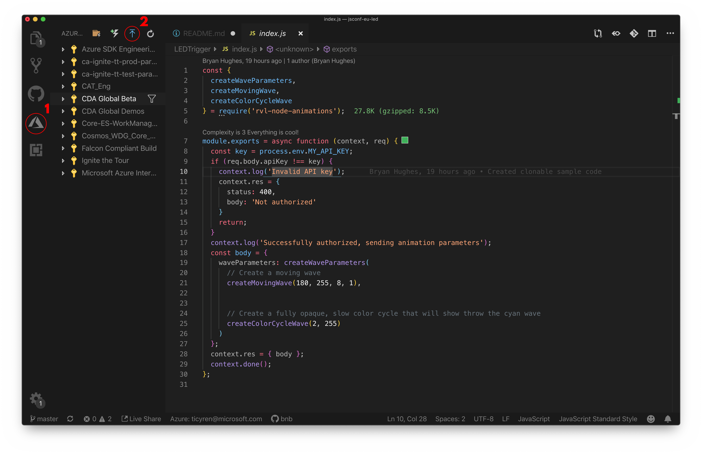

# Microsoft @ JSConf EU: LED Guide

At the Microsoft Booth this year, we're doing something extra special: an attendee-controlled LED art piece.

In this guide, we're going to go over the various parts you'll need to know (and extras you may _want_ to know) to control the LED art piece yourself!

## Table of Contents

- TBD

## Overview

At the Microsoft booth, we'll have a rather unique setup: [a programmable LED art piece][led-landing-page] that is controlled entirely by input received from JavaScript via [Azure Functions][azure-functions-docs].

Attendees can submit their own light patterns that will be queued up and run on the LED art piece. We welcome and encourage creative submissions, and are very much looking forward to seeing what you'll be able to do with the LED art piece.

Here are various the key things you'll want to know about if you're interested in submitting your own LED animations:

- Azure Functions
  - The Functions as a Service (a.k.a. Serverless) tool available from Azure
  - Check out [Creating and Deploying Azure Functions][creating-and-deploying-azure-functions] for more information on getting started!
- [rvl-node-animations][rvl-node-animations-npm]
  - The module by [Bryan Hughes][nebrius-twitter] that makes creating animations for the LED art piece significantly more simple than hardcoding 80 sin wave coefficients.
  - Can be installed via `npm i rvl-node-animations`.
- [Submissions][submit-and-queue]
  - The page where you can submit your Azure Functions for the LED art piece

## Global Prerequisites

Since this project relies on Azure, you'll need an Azure account. If you don't already have an Azure account, you can sign up for a free one [here][use-azure]. With a free account, you get 1,000,000 Azure Functions executions per month.

Additionally, we're going to be working from this repository as a starting point, so let's clone it now with `git clone https://github.com/bnb/jsconf-eu-led.git`. We'll be doing most, if not all, of our work in the `jsconf-eu-led` folder we just cloned.

## Specifications

Custom animations are an HTTP-triggered Function that are called from the LED art piece infrastructure, which is also written using Azure Functions.

The request made to your Function is an HTTPS POST request with a small JSON payload (a.k.a. the `content-type` is set to `application/json`). The JSON payload with the following shape:

```json
{
  "apiKey": "api key as a string"
}
```

The response from your function is also in JSON, and should have its `content-type` set to `application/json` as well. The response has the following shape:

```json
{
  "waveParameters": {
    ...wave parameters here
  }
}
```

You can generate waveParameters by hand, but be warned that they consist of 82 8-bit integers. We recommend you use the [rvl-node-animations package][rvl-node-animations-npm] to generate them instead.

### About API Keys

API Keys are optional, but it's good security to get in the habit of using them. The purpose of these keys is so that _you_ can verify that the person calling your Function is indeed us, and not someone else. You submit an API key through the submission page, or have one generated for you. Generated keys are version 4 UUIDs, which are generated using the [uuid npm package][uuid-npm], but can be of any format you prefer. If you prefer not to use API keys, then ignore this field in code and the web submission clients.

The API Key should _never_ be stored in your source code directly, as this makes it easy to accidentally leak the key. Instead, the key should be stored in an environment variable called `API_KEY` and accessed in your Function code via `process.env.API_KEY`. You can store the key to an environment in Azure Functions in one of two ways: 1) as an [application setting][application-settings] or 2) using Azure Key Vault. Azure Key Vault is the proper way to store any type of secret that you need to read in a secure manner. For more information on Azure Key Vault, check out [Tanya Janca's talk on it][tanya-key-vault] and the [Azure Key Vault documentation][key-vault]. Storing API Keys using application settings isn't very secure, however using Azure Key Vault is Yet One More Thing to Learn, so it's your call.

## Azure Functions In This Repository

This repository contains a starter function that will work out-of-the-box with the LED art piece at JSConf EU. With some configuration from you, you should be able to get you own animation up and running while at the conference by simply cloning this repo, making your tweaks, and shipping them to Azure.

Let's quickly dig into what's contained within this repo:

- `./LEDTrigger/` is a directory that contains all the setup needed for an Azure Function, mostly contained within `function.json`, and JavaScript that we want to run as a part of our Function.
- `host.json` is a simple config file that tells Azure Functions how to configure itself.
- `package.json` is our JavaScript manifest that provides some details about our app to Azure Functions and exposes dependencies to npm as requirements for the project.

To get the function set up, you'll want to run the following command:

```bash
npm install
```

This will install our single direct dependency, [rvl-node-animations][rvl-node-animations-npm], which the Azure Function uses by default.

From there, you're going to want to run your functions to test them and then deploy them to the cloud ☁️ to submit them!

### The Tools You'll Need

#### Working from the CLI

- You can find install instructions for `func` [here][func-install-instructions], also known as azure-functions-core-tools.
- You can find install instructions for `az` [here][az-install-instructions].

Be sure to install both of these dependencies, as we'll be using them later.

#### Working from VS Code

For development in VS Code, you'll want the Azure Functions extension for VS Code in addition to the tools we installed above. You can find instructions on how to get both set up for your environment in the the [VS Code docs][install-vs-code-reqs].

> If you have any questions about or issues with the getting the VS Code tools set up, feel free to ask anyone staffing the Microsoft booth – we'd be happy to help ✨

Once you've got the CLI and extensions installed, you'll need to sign in to Azure. You can accomplish this by opening the Command Palette and typing `Azure: Sign In`:


Additionally, you can open up the Azure Functions sidebar and click "Sign in to Azure..." to sign in. To get the sidebar to appear you may need to restart VS Code.

### Developing Your LED Animations with Azure Functions Locally

#### Local Development from the CLI

The `func start` command is available to you, allowing you to run your functions locally without the need to deploy them to the Cloud to test them.

Since we're working with HTTTP Trigger functions, you'll be provided a URL that they can be accessed from - you can check what they return at this URL.

If you would like to use Postman or similar tool to debug locally, be aware that the HttpTrigger we just created is listening for a POST request, a `Content-Type` of `application/json`, and with the following POST body:

```
{
    apiKey: 'api_key_here'
}
```

#### Local Development from VS Code

In VS Code, you have two options for local Function development:

- `func start` uses the Azure Functions Core Tools CLI, and is an easy way to kick off your functions from the integrated terminal inside of VS Code. Ensure the current working directory is the directory your functions are in.
- Pressing the `F5` key inside of VS Code automatically runs your functions, since you have the Azure Functions extension.

Since we're working with HTTTP Trigger functions, you'll be provided a URL that they can be accessed from - you can check what they return at this URL.

If you would like to use Postman or similar tool to debug locally, be aware that the HttpTrigger we just created is listening for a POST request, a `Content-Type` of `application/json`, and with the following POST body:

```
{
    apiKey: 'api_key_here'
}
```

### Deploying to the Cloud ☁️

#### Building Infrastructure and Deploying from the CLI

To deploy, you'll need the `az` CLI. Let's get the CLI set up + build out some Cloud infrastructure for you:

Run `az login` (be sure you have the `az` CLI [installed][az-install-instructions]). This will open up your default browser to an authentication page, where you should login with a Microsoft account that has Azure set up.

From there we're going to run a suite of commands to build out our cloud infrastructure:

- Run: `az group create --name jsconfEU --location westeurope`
  - This command creates a new Resource Group.
  - `az group create` is the command here, telling Azure to create a new Resource Group
  - `--name jsconfEU` is what we're going to call this Resource Group.
  - `--location westeurope` is telling Azure which region we want to host this Resource Group in. There are currently [54 regions][regions].
- Run: `az storage account create --name jsconfeustorage --location westeurope --resource-group jsconfEU --sku Standard_LRS`
  - This command creates a new storage account, which is where the code you're going to be running will be stored.
  - `az storage account create` is our command, telling Azure to create a new storage account.
  - `--name jsconfEUStorage` is passing the name of the storage account we want to create. In this case, we've selected `jsconfEUStorage` but this can be anything.
  - `--location westeurope` is telling Azure which region we want to host this Storage account in. Generally you'd want to have it in the same region as your Resource Group.
  - `--resource-group jsconfEU` is the Resource Group we want to attach this Storage account to. We want to have this be the same Resource Group as the one we created with the previous command.
  - `--sku Standard_LRS` is passing an identifier for – in this case – what kind of storage account we want to create. `Standard_LRS` represents Standard Locally Redundant Storage, which is the most basic form of Storage.
- Run: `az functionapp create --resource-group jsconfEU --consumption-plan-location westeurope \ --name jsconfeu-led --storage-account jsconfeustorage --runtime node`
  - This command tells Azure to create a Function App and connects it to the other two parts that we just built.
  - `az functionapp create` is our basic command, telling Azure to create a new Function App.
  - `--resource-group jsconfEU` is passing the resource group we want to set up this Function App in.
  - `--consumption-plan-location westeurope` sets up the Function App as consumption-based in the same region as our other resources
  - `--name jsconfeu-led` is the name of our Function App as it appears in Azure.
  - `--storage-account jsconfeustorage` connects the Function App to the Storage account that we created.
  - `--runtime node` tells the Function App that it's going to be a JavaScript Function App.
- Finally, run: `func azure functionapp publish jsconfeu-led`
  - Here, we're using the `func` CLI to publish to a Function App called `jsconfeu-led`, which is what we named the Function App we created in the previous step.

#### Building Infrastructure and Deploying from VS Code

To deploy to Azure, you're going to want to open up the Azure sidebar and then click the up arrow with a bar over it to upload your function:



Once you click this, the Extension will walk you through a series of steps to build out your infrastructure and ship your functions.

Here's a quick walkthrough for first-time deployments:

1. **Select the folder to deploy:** This should be the top-level folder that contains a `host.json` and has your Functions as sub-directories. In our case, this will very likely be `jsconf-eu-led` unless you're a git wizard or renamed your project directory after you cloned it.
2. **Select a subscription:** this is the Azure subscription you're going to be deploying your Functions to.
3. **Select a Functions App in Azure:** Choose which Functions app you're going to deploy the folder to. In our case, we're deploying for the first time and are going to want to click "Create New Function App in Azure".
4. **Create New Function App In Azure:**
    1. Enter a unique name (as in, one that nobody else on Azure has used before) for your Function App.
    2. Select the runtime to use. In our case, we're going to use JavaScript.
5. **Upload:** Once you finish step 4, this will begin automatically.

If you'd like to watch a short video on taking these steps, check out the [first-time deployment video in this repo](img/deploy-azure-functions-new-app.mp4).

Additionally, here's a quick walkthrough for subsequent deployments:

1. **Select the folder to deploy:** This should be the top-level folder that contains a `host.json` and has your Functions as sub-directories. In our case, this will very likely be `jsconf-eu-led` unless you're a git wizard or renamed your project directory after you cloned it.
2. **Select a subscription:** this is the Azure subscription you're going to be deploying your Functions to.
3. **Select a Functions App in Azure:** Choose which Functions app you're going to deploy the folder to. In our case, we're going to select the Functions App we deployed to previously.
4. **Upload:** Once you finish step 4, this will begin automatically.

If you'd like to watch a short video on taking these steps, check out the [existing deployment video in this repo](img/deploy-azure-functions-existing-app.mp4).

## Previewing and Submitting your Functions

Once you've built out your animation, you should submit it and have it be visualized with the in-person LED setup we've got!

### Preview Your Functions

We have created a simulator to help you debug your functions before submitting it to the real thing.

- Navigate to the [simulator](https://aka.ms/jsconfeu/led-simulator).
- Get the URL of your Function.
  - This will be `<your function app>.azurewebsites.net/api/<your function name>`, where `<your function app>` is the name of the Functions App you deployed and `<your function name>` is the name of the directory of the function you're calling. In the case of this repo, `<your function name>` would be `LEDTrigger`.
  - You can also get the URL directly from the Azure Functions extension for VS Code, by opening up the subscription you deployed to, selecting the function you deployed, opening the "Functions" drop down, right clicking the name of the function you want to get the URL for, and clicking "Copy Function Url".
- Paste the URL of the function into the simulator.
  - If you've defined an API key as an environment variable or hard coded it into your function, also enter that!
- Click "Run"!

 Note: Function URLs that don't start with `<your function app>.azurewebsites.net` are rejected by the server. This does mean you cannot use a custom domain with your Function.

### Submit Your Functions

Ready to run your animation on the actual LED art piece? Here's how:

- Head over to the [submission][submit-and-queue] site.
- Put the URL of your Azure Function in the `Azure Function Endpoint` field.
- Put your API key in the `API Key`, if you've set one up.
- Put the name you want to be identified as in the queue in the `Display Name` field.
- Submit!
  - Your entry will be queued up and run. Once run, all the information you entered into the three fields is dropped from the queue and not stored/retained in any other way.*

*We do collect anonymized statistics on submissions. We store three fields: 1) the HTTP status code returned by the simulator, 2) the time of the submission, 3) and the type of submission (to the simulator, to the real thing, or from a tablet at the booth to the real thing). This anonymized data will be deleted at most 1 week after the event.

## Credits

- Bryan Hughes ([Twitter][nebrius-twitter], [GitHub][nebrius-github]) put a tremendous amount of time and effort into making this project a success. Without his work, this entire project would not exist. If you like it, you should take a moment to thank him 💜
- Jan Schenk ([Twitter][jansche-twitter], [GitHub][jansche-github]) was an awesome help inside of Germany, working on setting up and configuring the IoT rig to work as expected once Bryan Hughes had sent it over.
- Tierney Cyren ([Twitter][bnb-twitter], [GitHub][bnb-github]) for working on the content within this repository.
- The maintainers of [clone-deep](npm.im/clone-deep), [is-plain-object](npm.im/is-plain-object), [isobject](npm.im/isobject), [kind-of](npm.im/kind-of), and [shallow-clone](npm.im/shallow-clone) – which is the entire dependency tree introduced to our function via [rvl-node-animations](npm.im/rvl-node-animations).

<!-- Azure Docs and other related links -->
[submit-and-queue]: http://aka.ms/jsconfeu/led-custom
[azure-functions-docs]: https://aka.ms/jsconfeu/azure-functions-docs
[func-install-instructions]: https://aka.ms/jsconfeu/func-install
[az-install-instructions]: https://aka.ms/jsconfeu/az-install
[install-vs-code-reqs]: https://aka.ms/jsconfeu/install-vs-code-reqs
[use-azure]: https://aka.ms/jsconfeu/free
[regions]: https://aka.ms/jsconfeu/regions
[application-settings]: https://aka.ms/jsconfeu/app-settings
[key-vault]: https://aka.ms/jsconfeu/key-vault

<!-- Social links in Credits and elsewhere -->
[nebrius-twitter]: https://twitter.com/nebrius
[nebrius-github]: https://github.com/nebrius
[jansche-twitter]: https://twitter.com/jansche
[jansche-github]: https://github.com/jansche
[bnb-twitter]: https://twitter.com/bitandbang
[bnb-github]: https://github.com/bnb

<!-- Module Links -->
[rvl-node-animations-npm]: https://www.npmjs.com/package/rvl-node-animations
[uuid-npm]: https://www.npmjs.com/package/uuid

<!-- Miscellaneous Links -->
[led-landing-page]: https:/aka.ms/jsconfeu/led
[tanya-key-vault]: https://www.youtube.com/watch?v=-RkldpfPd9o
